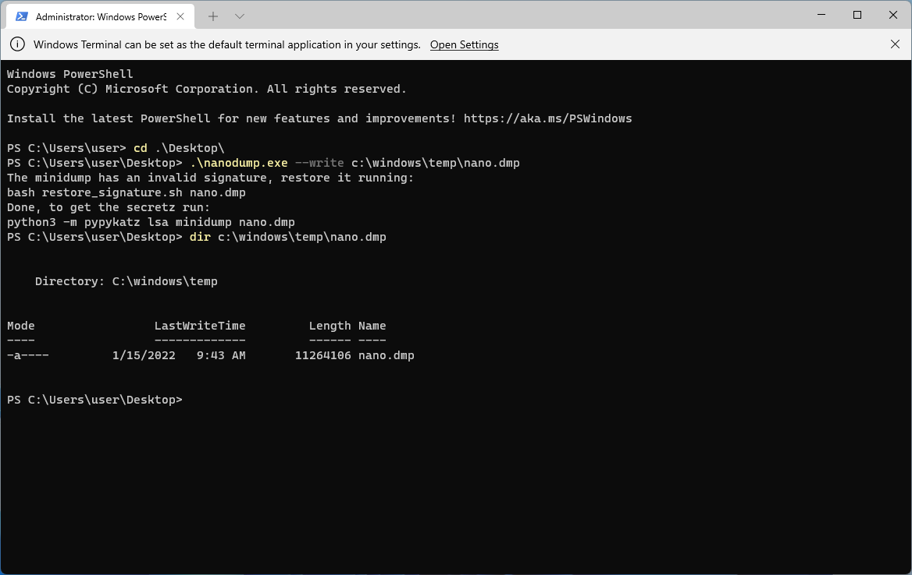
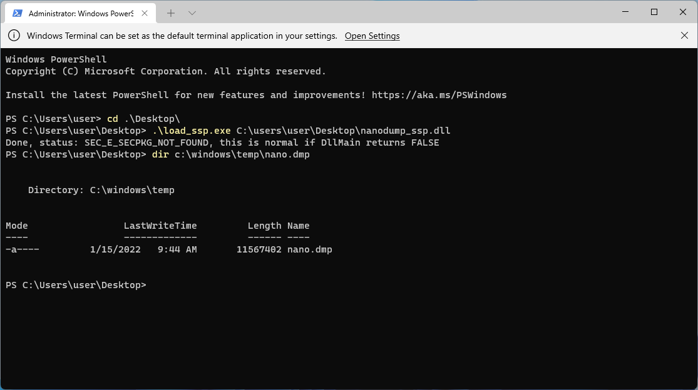

# nanodump
This project based on [nanodump](https://github.com/helpsystems/nanodump), big thanks to @S4ntiagoP  

# basic
vs2019 + cpp

# usage(x86&x64)
nanodump --write c:\windows\temp\nano.dmp

load_ssp c:\windows\temp\nanodump_ssp.dll

